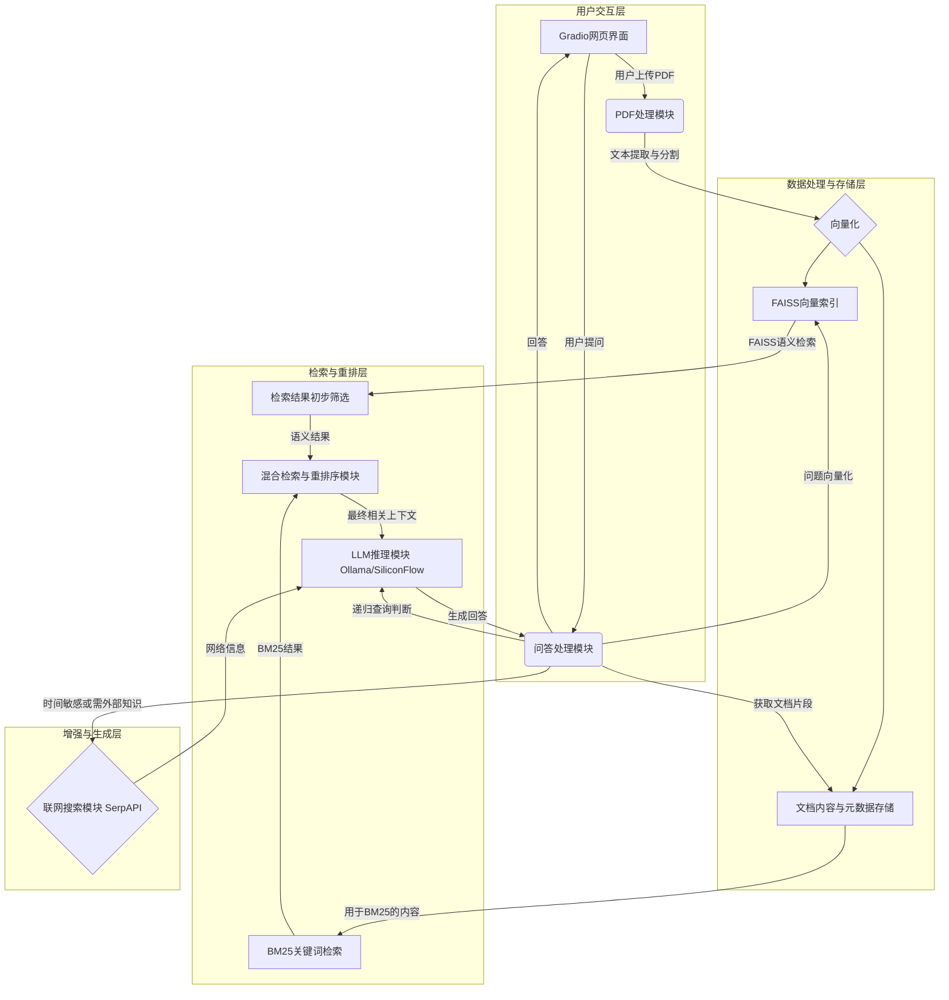
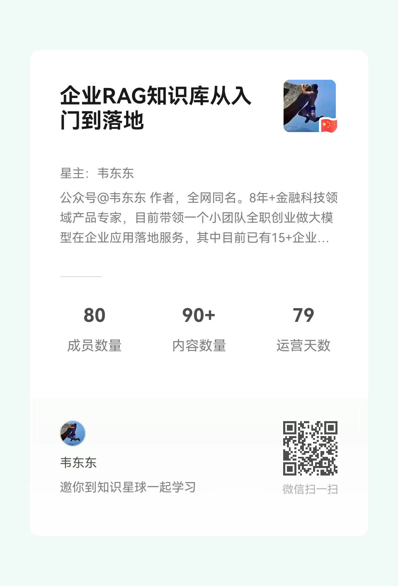

<div align="center">
<h1>📚 本地化智能问答系统 (FAISS版)</h1>
<p>


</p>

**一个帮助RAG入门者理解核心组件和流程的本地化智能问答项目**
</div>

## 🎯 项目目标与定位

本项目旨在为希望学习和理解RAG（Retrieval-Augmented Generation，检索增强生成）技术的初学者提供一个清晰、可动手实践的起点。在接触如 [Dify](https://dify.ai/)、[RAGFlow](https://github.com/infiniflow/ragflow) 这类高度封装的RAG框架之前，通过本项目的源码和实践，你可以：

*   **熟悉RAG核心组件**：亲身体验文本加载、切分、向量化、向量存储与检索（本项目使用FAISS）、大模型集成等关键环节。
*   **理解RAG基本流程**：从底层脚本层面观察数据如何在RAG系统中流转和处理。
*   **进行初步优化与测试**：尝试调整参数、替换模型、优化提示词等，直观感受不同策略对结果的影响。

掌握这些基础后，能更有的放矢地使用高级RAG框架的API进行针对性调优或定制开发。

## 🌟 核心功能

*   📁 **PDF文档处理**：上传并处理多个PDF文档，自动分割和向量化。
*   🧠 **智能问答**：基于本地文档的精准问答能力。
*   🔍 **混合检索**：结合FAISS进行语义检索和BM25进行关键词检索，提高检索召回率和准确性。
*   🔄 **结果重排序**：支持交叉编码器（CrossEncoder）和LLM对检索结果进行重排序，优化相关性。
*   🌐 **联网搜索增强 (可选)**：通过SerpAPI获取实时网络信息，增强回答的时效性（需配置API密钥）。
*   🗣️ **多LLM支持**：可选择使用本地Ollama大模型（如DeepSeek-R1系列）或云端SiliconFlow API进行推理。
*   迭代式深度检索（递归检索）：通过LLM分析当前结果，自动生成后续查询，深入探索问题。
*   📄 **来源标注与矛盾检测 (初步)**：尝试在回答中提供信息来源，并识别潜在信息矛盾。
*   🖥️ **用户友好界面**：基于Gradio构建交互式Web界面，方便文档上传、提问和结果查看。
*   📊 **分块可视化**：在UI上展示文档分块情况，帮助理解数据处理过程。
*   🔒 **本地化优先**：核心数据处理和LLM推理可完全在本地进行，保障数据隐私。

## 🔧 系统架构



## 🚀 使用方法

### 环境准备

1.  **创建并激活虚拟环境** (推荐使用Python 3.9+):
    ```bash
    python -m venv rag_env
    # Windows
    rag_env\Scripts\activate
    # Linux/macOS
    source rag_env/bin/activate
    ```
2.  **安装依赖项**:
    ```bash
    pip install -r requirements.txt
    ```
3.  **安装并启动Ollama服务** (如果希望使用本地大模型):
    *   访问 [https://ollama.com/download](https://ollama.com/download) 下载并安装Ollama。
    *   启动Ollama服务: `ollama serve`
    *   拉取所需模型，例如: `ollama pull deepseek-r1:1.5b` 或 `ollama pull deepseek-r1:7b` (根据您的硬件配置选择)。本项目默认尝试使用`deepseek-r1:1.5b` 和 `deepseek-r1:7b`。
4.  **配置API密钥 (可选)**:
    在项目根目录创建 `.env` 文件，并按需添加以下内容：
    ```env
    # 用于联网搜索
    SERPAPI_KEY=您的SERPAPI密钥

    # 用于SiliconFlow云端大模型
    SILICONFLOW_API_KEY=您的SiliconFlow API密钥
    # SILICONFLOW_API_URL=https://api.siliconflow.cn/v1/chat/completions (不需要修改)
    ```

### 启动服务

```bash
python rag_demo_pro.py
```
服务启动后，通常会自动在浏览器中打开 `http://127.0.0.1:17995` (或自动选择的其他可用端口)。

### 运行日志示例与解读

当您运行 `python rag_demo_pro.py` 并开始使用（例如上传PDF并提问）后，终端会输出详细的运行日志。这些日志对于理解系统内部工作流程至关重要。

一个典型的成功运行片段可能如下所示（已省略部分重复内容和时间戳）：

```log
INFO:root:成功清理历史FAISS数据和BM25索引
Batches: 100%|██████████| 1/1 [00:02<00:00,  2.71s/it] # 文本块向量化
INFO:root:FAISS索引构建完成，共索引 9 个文本块
Building prefix dict from the default dictionary ...
Loading model cost 6.168 seconds.
Prefix dict has been built successfully.
INFO:root:BM25索引更新完成，共索引 9 个文档

INFO:root:递归检索迭代 1/3，当前查询: 发动机冒蓝烟的故障原因分析
INFO:root:网络搜索返回 5 条结果，这些结果不会被添加到FAISS索引中。
Batches: 100%|██████████| 1/1 [00:00<00:00,  3.53it/s] # 查询向量化
INFO:sentence_transformers.cross_encoder.CrossEncoder:Use pytorch device: cpu
INFO:root:交叉编码器加载成功
Batches: 100%|██████████| 1/1 [00:07<00:00,  7.42s/it] # 交叉编码器重排序
INFO:root:使用SiliconFlow API分析是否需要进一步查询
INFO:root:生成新查询: 新查询(如果需要):
1. 涡轮增压器故障是否会引起发动机冒蓝烟？
...
INFO:root:递归检索迭代 2/3，当前查询: 新查询(如果需要):...
...
INFO:root:递归检索迭代 3/3，当前查询: 新查询:...
...(后续为LLM整合上下文生成最终答案的过程)
```

**日志关键点解读：**

*   **FAISS与BM25索引构建**：显示了文档处理后向量索引和关键词索引的成功创建。
*   **递归检索迭代**：清晰展示了系统如何通过多轮查询（此处配置为3轮）来逐步深化对用户问题的理解和信息召回。
*   **模型加载与使用**：包括SentenceTransformer（用于向量化和交叉编码器）、Jieba（用于BM25分词）的加载，以及与LLM（此处为SiliconFlow API）的交互。
*   **中间过程**：如网络搜索结果的获取、交叉编码器重排序的时间消耗等，都为性能分析和流程理解提供了线索。
*   **LLM生成新查询**：当LLM（如SiliconFlow或Ollama）分析后认为需要更深入的信息时，它会主动生成更具体的新查询点，驱动下一轮的检索，这是高级RAG能力的体现。

建议通过观察这些日志，直观地感受到RAG系统中各个组件是如何协同工作的。

## 📦 核心依赖

*   `gradio`: 构建交互式Web界面。
*   `sentence-transformers`: 用于文本向量化和交叉编码器重排序。
*   `faiss-cpu`: 高效的向量相似性搜索引擎。
*   `langchain-text-splitters`: 仅用于文本分割功能，更加轻量。
*   `pdfminer.six`: 从PDF文件中提取文本。
*   `rank_bm25`: 实现BM25关键词检计算法。
*   `jieba`: 中文分词，用于BM25索引和可能的文本预处理。
*   `python-dotenv`: 管理环境变量 (如API密钥)。
*   `requests`, `urllib3`: 进行HTTP请求 (如调用SerpAPI, SiliconFlow API, Ollama API)。
*   `numpy`: FAISS等库的基础依赖，进行数值计算。
*   (可选API服务) `fastapi`, `uvicorn`, `python-multipart`: 如果您想独立运行`api_router.py`提供API服务。

## 💡 进阶与扩展方向

本项目作为一个入门级的RAG实现，为后续的迭代和功能扩展提供了良好的基础。以下是一些可以考虑的进阶方向：

1.  **更精细化的文本切分策略**：
    *   **解释**：当前的`RecursiveCharacterTextSplitter`是通用策略。可以研究并实现基于语义的切分（如使用模型判断句子边界或主题连贯性）、或针对特定文档类型的结构化切分（如解析Markdown标题、表格等）。
    *   **难度**：中等。
2.  **高级FAISS索引与管理**：
    *   **解释**：目前使用的是基础的`IndexFlatL2`。可以尝试更高级的FAISS索引类型，如`IndexIVFPQ`，以优化大规模数据下的检索速度和内存占用。同时，研究如何更优雅地支持对FAISS中向量的删除和更新（例如，使用`IndexIDMap`）。
    *   **难度**：中等至困难。
3.  **多元数据源接入**：
    *   **解释**：目前主要处理PDF和可选的网络搜索。可以扩展支持导入其他格式的本地文档（如`.txt`, `.md`, `.docx`），或者接入外部API（如Notion、Confluence等知识库）。
    *   **难度**：中等。
4.  **查询改写与意图识别**：
    *   **解释**：在进行检索前，使用LLM对用户的原始查询进行改写（如纠错、同义词扩展、澄清模糊表述）或识别用户真实意图，可以提高检索的精准度。
    *   **难度**：中等。
5.  **上下文管理与压缩**：
    *   **解释**：当检索到的相关片段过多，超出LLM的上下文窗口限制时，需要有效的上下文压缩策略（如筛选最重要片段、总结次要片段）来保证信息质量。
    *   **难度**：中等。
6.  **更复杂的重排序模型/策略**：
    *   **解释**：除了当前的交叉编码器和基于LLM打分，可以尝试集成更先进的重排序模型，或实现多阶段重排序策略。
    *   **难度**：中等至困难。
7.  **答案生成效果评估与追溯**：
    *   **解释**：引入简单的评估机制（如用户反馈、答案与来源的相似度计算）和更清晰的答案来源追溯展示，帮助分析和改进系统表现。
    *   **难度**：中等。

欢迎大家基于此项目进行探索和贡献！

## 🚀 进一步学习与交流

本项目旨在提供一个RAG入门的练手平台。如果你对企业级RAG的深入实践、复杂场景应用、性能优化以及最新技术进展感兴趣，欢迎加入我的知识星球 **"企业RAG从入门到落地"** 进行更深入的学习和交流。

<div align="center" style="display: flex; justify-content: space-around; flex-wrap: wrap; gap: 20px; margin-top: 30px;">
  <div style="text-align: center; margin: 10px;">
    
    <p>公众号: 韦东东</p>
  </div>
  <div style="text-align: center; margin: 10px;">
    
    <p>小红书: 韦东东</p>
  </div>
  <div style="text-align: center; margin: 10px;">
    
    <p>知识星球: 企业RAG从入门到落地</p>
  </div>
</div>

## 📝 许可证

本项目采用MIT许可证。


